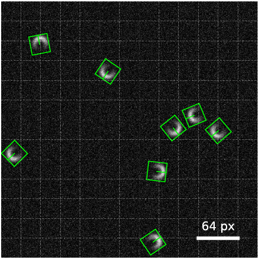

# YOLOTrack 1.1

*M. Fränzl*

Molecular Nanophotonics Group, Peter Debye Institute for Soft Matter Physics, Universität Leipzig, Linnestr. 5, 04103 Leipzig, Germany

[M. Fränzl and F. Cichos, ..., ... (2020)](https://home.uni-leipzig.de/~physik/sites/mona/).

## Content

- [Description](#description)
- [Repository Contents](#repository-contents)
- [Users Guide](#users-guide)
- [System Requirements](#system-requirements)
- [Setup Instructions](#setup-instructions)
- [License](./LICENSE)

## Description 

This is an extension of the [YOLOTrack 1.0](https://github.com/Molecular-Nanophotonics/YOLOTrack-1.0/) to detect oriented bounding boxes. 

<!-- This is a framework for the real-time localization and classification of objects in optical microscopy images using a single-shot covolutional neural network YOLO ("You Only Look Once") . We adapted the TinyYOLOv2 architecture enabling to localize and classify objects at very low signal-to-noise ratios for images as large as 416 x 416 px at frame rates of up to 100 fps. Here, we provide scripts to train the network in Python/Keras using the TensorFlow backend and source codes to run the model inference on a GPU with C++ or LabVIEW.
-->

    
  <b>Fig. 1</b> YOLOTrack 1.1 detection for a synthetic image of Janus-type particles as observed in a darkfield microscope.

## Repository Contents

- [YOLOTrack 1.1 Training (Python)](./YOLOTrack%201.1%20Training%20(Python)):  Jupyter notebooks and Python modules for synthetic image generation, training and exporting YOLOTrack 1.1 models with Python/Keras using the TensorFlow backend
- [TF DLL](./TF%20DLL): DLL for running TensorFlow models on GPU (`TF.dll`)
- [YOLOTrack 1.1 DLL](./YOLOTrack%201.1%20DLL): DLL for decoding the YOLOTrack 1.1 output tensor (`YOLOTrack11.dll`)
- [YOLOTrack 1.1 Inference (LabVIEW)](./YOLOTrack%201.1%20Inference%20(LabVIEW)): Example for importing and running a trained YOLOTrack 1.1 model in LabVIEW
- [YOLOTrack 1.1 Inference (C++)](./YOLOTrack%201.1%20Inference%20(C%2B%2B)): Example for importing and running a trained model with Qt/C++

## Users Guide

See [YOLOTrack 1.0](https://github.com/molecular-nanophotonics/YOLOTrack-1.0/).

## System Requirements

See [YOLOTrack 1.0](https://github.com/molecular-nanophotonics/YOLOTrack-1.0/).

## Setup Instructions

For setup instructions refer to the `README.md` in each directory. 
