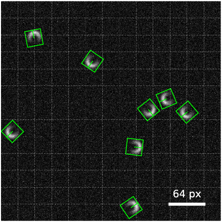

# YOLOv2.1 Framework for Digital Microscopy

*M. Fränzl*

Molecular Nanophotonics Group, Peter Debye Institute for Soft Matter Physics, Universität Leipzig, Linnestr. 5, 04103 Leipzig, Germany

[M. Fränzl and F. Cichos, ..., ... (2020)](https://home.uni-leipzig.de/~physik/sites/mona/).

## Content

- [Discription](#discription)
- [Repository Contents](#repository-contents)
- [Users Guide](#users-guide)
- [System Requirements](#system-requirements)
- [Setup Instructions](#setup-instructions)
- [License](./LICENSE)

## Discription 

This is an extension of the [YOLOv2-Framework](https://github.com/molecular-nanophotonics/YOLOv2-Framework/) to detect oriented bounding boxes. 

<!-- This is a framework for the real-time localization and classification of objects in optical microscopy images using a single-shot covolutional neural network YOLO ("You Only Look Once") . We adapted the YOLOv2 architecture enabling to localize and classify objects at very low signal-to-noise ratios for images as large as 416 x 416 px at frame rates of up to 100 fps. Here, we provide scripts to train the network in Python/Keras using the TensorFlow backend and source codes to run the model inference on a GPU with C++ or LabVIEW.
-->

    
  <b>Fig. 1</b> YOLOv2.1 detection for a synthetic image of Janus-type particles as observed in a darkfield microscope.

## Repository Contents

- [YOLOv2.1 Training (Python)](./YOLOv2%20Training%20(Python)):  Jupyter notebooks and Python modules for synthetic image generation, training and exporting YOLOv2.1 models with Python/Keras using the TensorFlow backend
- [TF DLL](./TF%20DLL): DLL for running TensorFlow models on GPU (`TF.dll`)
- [YOLOv21 DLL](./YOLOv21%20DLL): DLL for decoding the YOLOv2.1 output tensor (`YOLOv21.dll`)
- [YOLOv21 Inference (LabVIEW)](./YOLOv2%20Inference%20(LabVIEW)): Example for importing and running a trained YOLOv2.1 model in LabVIEW
- [YOLOv21 Inference (C++)](./YOLOv21%20Inference%20(C%2B%2B)): Example for importing and running a trained model with Qt/C++

## Users Guide

See [YOLOv2-Framework](https://github.com/molecular-nanophotonics/YOLOv2-Framework/).

## System Requirements

See [YOLOv2-Framework](https://github.com/molecular-nanophotonics/YOLOv2-Framework/).

## Setup Instructions

For setup instructions refer to the `README.md` in each directory. 
